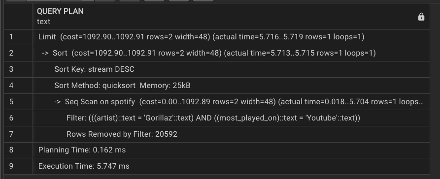
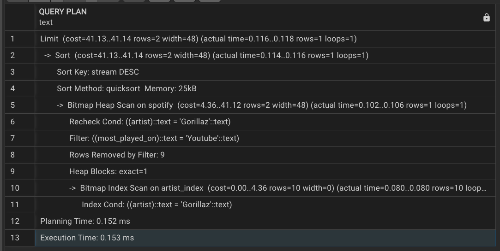

# Advanced SQL Analytics & Query Optimization

## Project Overview

This project uses a Spotify music dataset as a practical case study for **advanced PostgreSQL analytics and query performance optimization**.

The project demonstrates an analyst's workflow from structured data exploration through analytical SQL and execution-plan analysis:

```text
Raw Dataset
    ↓
Data Profiling & Preparation
    ↓
PostgreSQL Data Model
    ↓
Analytical SQL
    ├── Aggregations
    ├── Joins
    ├── Subqueries
    ├── CTEs
    └── Window Functions
    ↓
Query Performance Analysis
    ↓
EXPLAIN ANALYZE
    ↓
Index Design
    ↓
Before vs After Benchmark
    ↓
Technical Conclusions
```

## Business / Analytical Objective

The project is designed to answer questions around:

- Track and content performance
- Artist-level performance
- Album-level performance
- Audience engagement
- Streaming and view behavior
- Advanced SQL-based ranking and aggregation
- Query performance and indexing

The emphasis is on turning a denormalized analytical dataset into reproducible SQL analysis and demonstrating how database performance can be investigated systematically.

## Dataset

The dataset contains track-, artist-, album-, engagement-, and audio-feature attributes including:

- Artist
- Track
- Album
- Album type
- Danceability
- Energy
- Loudness
- Speechiness
- Acousticness
- Instrumentalness
- Liveness
- Valence
- Tempo
- Duration
- Views
- Likes
- Comments
- Licensed
- Official video
- Streams
- Most played platform

The cleaned dataset used in the project is included as `cleaned_dataset.csv`.

> **Dataset note:** The project uses a prepared Spotify dataset for analytical practice. The repository does not claim ownership of the underlying source data.

## Data Model

The current analytical implementation uses a single PostgreSQL table named `spotify`.

This repository focuses on **data modeling and analytical preparation** rather than claiming a fully normalized relational production schema.

## Analytical SQL

The query set is organized into five areas:

### 1. Track & Content Analysis
- Tracks exceeding 1 billion streams
- Single releases
- Highest-energy tracks
- Above-average liveness
- Energy-to-liveness ratios

### 2. Artist Analysis
- Track counts by artist
- Top 3 viewed tracks per artist using `ROW_NUMBER()`

### 3. Album Analysis
- Album/artist relationships
- Average danceability by album
- Total views by album
- Energy range using a CTE

### 4. Engagement Analysis
- Comments on licensed tracks
- Official-video performance
- Spotify streams versus views
- Cumulative likes using window functions

### 5. Summary Analytics
- Dataset-level KPI summary
- Engagement comparison by album type

## Advanced SQL Techniques

The project demonstrates:

- `GROUP BY` and aggregations
- Filtering and conditional analysis
- Subqueries
- Common Table Expressions (CTEs)
- Window functions
- `ROW_NUMBER()`
- Running totals
- `NULLIF()` for safe ratio calculations
- Multi-dimensional analytical grouping

## Query Optimization

A key technical component investigates performance for an artist-filtered query.

### Baseline

The original project recorded:

- Execution time: **7 ms**
- Planning time: **0.17 ms**

### Index

An index was created on the frequently filtered `artist` column:

```sql
CREATE INDEX idx_spotify_artist
ON spotify (artist);
```

### Post-index benchmark

The original project recorded:

- Execution time: **0.153 ms**
- Planning time: **0.152 ms**

These measurements are **historical, environment-specific benchmarks**. Actual performance varies with hardware, PostgreSQL version, data volume, statistics, cache state, and query plan.

The optimization workflow is reproducible through `EXPLAIN ANALYZE` in `sql/03_query_optimization.sql`.

## Performance Evidence

### EXPLAIN — Before Index



### EXPLAIN — After Index



### Performance Visualizations


## Technical Findings

The project demonstrates that:

1. SQL can support both descriptive analytics and more advanced analytical workflows.
2. Window functions are useful for within-group ranking and cumulative analysis.
3. CTEs can make multi-step analytical logic easier to structure and interpret.
4. Indexing can provide a more efficient access path for selective filters when the optimizer determines it is beneficial.
5. `EXPLAIN ANALYZE` should be used to validate performance changes rather than assuming an index will always improve a query.

## Analytical Boundaries

This project is an analytical SQL case study. It does **not** establish:

- Causal relationships between audio characteristics and popularity
- User-level listening behavior
- Business profitability
- Customer lifetime value
- Experimental effects
- Universal database performance improvements

The dataset contains observational records, so analytical relationships should be interpreted as descriptive rather than causal.

## Repository Structure

```text
Spotify-Data-Analysis-using-SQL/
│
├── README.md
├── cleaned_dataset.csv
│
├── sql/
│   ├── 01_schema_and_setup.sql
│   ├── 02_analytical_queries.sql
│   └── 03_query_optimization.sql
│
├── spotify_explain_before_index.png
├── spotify_explain_after_index.png
├── spotify_graphical view 1.png
├── spotify_graphical view 2.png
├── spotify_graphical view 3.png
└── spotify_logo.jpg
```

## Skills Demonstrated

- PostgreSQL
- Advanced SQL
- Data Modeling
- Data Preparation
- Aggregations
- Joins
- Subqueries
- CTEs
- Window Functions
- Query Optimization
- EXPLAIN ANALYZE
- Indexing
- Performance Benchmarking
- Analytical Reasoning

## How to Run

1. Install PostgreSQL and a SQL client such as pgAdmin.
2. Load `cleaned_dataset.csv` into the `spotify` table using `sql/01_schema_and_setup.sql`.
3. Run `sql/02_analytical_queries.sql` for the analytical query set.
4. Run `sql/03_query_optimization.sql` to reproduce the indexing and performance-analysis workflow.
5. Review the execution plans and compare the results with the historical benchmark recorded above.

## Source

The original project references the Spotify dataset available through Kaggle.

## License

See the repository's current license metadata for licensing status.
